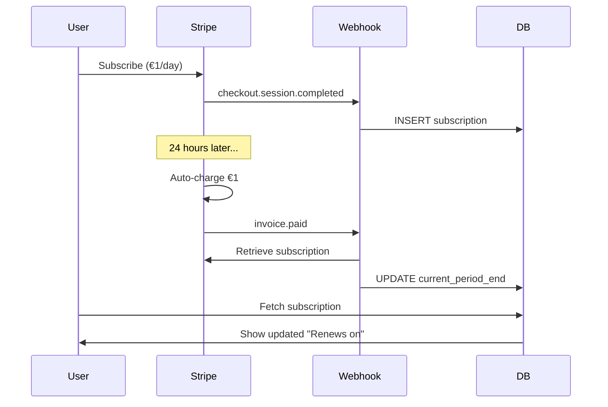

# Daily Subscription Testing Guide

## 🧪 Test Daily Subscription (€1/day)

Pre testovanie **automatic renewal** sme vytvorili špeciálny tier s **denným intervalom**.

### 📋 Detaily

- **Tier**: Test Daily (test_daily)
- **Cena**: €1/deň
- **Interval**: DAILY (obnovuje sa každých 24 hodín)
- **Price ID**: `price_1SQahsKF1O52aJAISkI7AttC`
- **Účel**: Rýchle testovanie automatic renewal (nemusíte čakať celý mesiac)

### 🚀 Ako testovať

#### 1. Príprava

```bash
# Uistite sa, že beží webhook listener
ps aux | grep "stripe listen"

# Ak nie, spustite:
stripe listen --forward-to localhost:3000/api/webhooks/stripe

# Reštartujte dev server (aby načítal nové env variables)
# Ctrl+C → npm run dev
```

#### 2. Vytvorte subscription

1. Otvorte: http://localhost:3000/support
2. Uvidíte **"Test Denné"** tier na vrchu so žltým rámikom (🧪 TEST MODE)
3. Kliknite **"Vybrať plán"**
4. Test karta: `4242 4242 4242 4242`
5. Email, meno, CVC (napr. 123)
6. Dokončite platbu

#### 3. Overte subscription

1. Presmeruje vás na `/thank-you`
2. Choďte na `/account`
3. Uvidíte:
   ```
   Active Subscription
   ───────────────────
   Plan: Test Daily
   Price: €1/day
   Status: Active
   Renews on: 2025-11-07  ← Zajtra
   ```

#### 4. Simulujte renewal (bez čakania 24h)

Poznačte si `subscription_id` z Stripe Dashboard alebo z databázy:

```bash
# Spustite test script
./test-daily-renewal.sh sub_YOUR_SUBSCRIPTION_ID

# Príklad:
./test-daily-renewal.sh sub_1SQaZhKF1O52aJAIYkK0ZK7o
```

**Alebo manuálne:**

```bash
# Metóda 1: Trigger webhook
stripe trigger invoice.payment_succeeded \
  --override subscription=sub_YOUR_SUB_ID

# Metóda 2: Fast-forward billing cycle
stripe subscriptions update sub_YOUR_SUB_ID \
  --billing-cycle-anchor now
```

#### 5. Overte výsledky

1. **Server logs** by mali ukázať:
   ```
   💰 Invoice paid for subscription: sub_xxx
   ✅ Subscription updated with new billing period
   ```

2. **Obnovte /account page**:
   - "Renews on" dátum by mal byť **+1 deň**
   - Status zostáva **"active"**

3. **Database**:
   ```sql
   SELECT * FROM subscriptions 
   WHERE user_id = 'd0d8b50c-48a2-41c7-9d8d-a0b87422438c';
   
   -- current_period_end by mal byť aktualizovaný!
   ```

### 🔁 Opakované testovanie

Môžete spustiť `./test-daily-renewal.sh` **viackrát** aby ste simulovali viacero dní:

```bash
# Deň 1 (dnes): Subscribe €1
./test-daily-renewal.sh sub_xxx

# Deň 2 (simulácia): Renewal €1
./test-daily-renewal.sh sub_xxx

# Deň 3 (simulácia): Renewal €1
./test-daily-renewal.sh sub_xxx
```

Každé spustenie:
- Stiahne ďalší €1 (v test mode je to fake)
- Pošle webhook `invoice.paid`
- Aktualizuje `current_period_end` (+1 deň)
- Zobrazí nový dátum na `/account`

### 📊 Čo sa deje v pozadí



### ⚠️ Troubleshooting

**Problém: Webhook sa nespracoval**
```bash
# Check webhook listener
ps aux | grep "stripe listen"

# Check server logs
# Look for: "🔔 Webhook received!"

# Check Stripe CLI logs
# Look for: "POST http://localhost:3000/api/webhooks/stripe [200]"
```

**Problém: Database sa neaktualizovala**
```bash
# Check handleInvoicePaid function logs
# Should see: "💰 Invoice paid for subscription"

# Verify RLS policies
# subscriptions table must allow UPDATE for service_role
```

**Problém: "Renews on" sa nezmenil**
```bash
# Hard refresh browser (Cmd+Shift+R)
# Check Network tab - should see fresh data

# Query DB directly
SELECT current_period_end FROM subscriptions 
WHERE stripe_subscription_id = 'sub_xxx';
```

### 🎯 Production Note

**V produkcii** nebudete musieť manuálne triggernúť webhooks:
- Stripe automaticky posielá `invoice.paid` každých 24h
- Webhook endpoint musí byť nakonfigurovaný v Stripe Dashboard
- URL: `https://yourdomain.com/api/webhooks/stripe`
- Events: `invoice.paid`, `customer.subscription.updated`, `customer.subscription.deleted`

Pre daily tier je to **skutočne každý deň** o tej istej hodine!

### 🗑️ Cleanup po testovaní

```bash
# Cancel subscription
stripe subscriptions cancel sub_YOUR_SUB_ID

# Alebo v dashboard:
# Stripe Dashboard → Subscriptions → Cancel

# Delete z DB
DELETE FROM subscriptions WHERE tier = 'test_daily';
```

### 📝 Next Steps

Po úspešnom testovaní:
1. ✅ Viete, že automatic renewal funguje
2. ✅ Viete, že webhooks správne aktualizujú DB
3. ✅ Môžete nasadiť do production s mesačnými tiermi
4. ✅ Stripe sa postará o všetko automaticky
